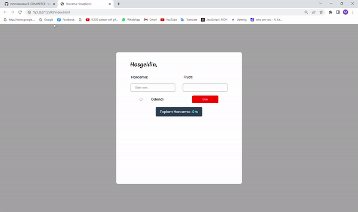

# Spending Calculator

This project is a simple spending calculator built using HTML, CSS, and JavaScript. It allows users to track their expenses and income, and provides a summary of their spending in different categories.

## Features
 
 <ul>
   <li>Add income and expenses</li>
   <li>View summary of spending by category</li>
   <li>Responsive design</li>
   <li>Visual representation of spending using charts</li>
 </ul>

 ## Technologies Used

 <ul>
   <li>HTML</li>
   <li>CSS</li>
   <li>JavaScript</li>
 </ul>

 ## Installation

 1. Clone the repository from GitHub:

 ### git clone https://github.com/mhmtkarakas/ExpenseCalculator--with-Javascript.git

 2. Open the project folder and launch index.html in your browser.

 ## ScreenGif

  

  
The above screenshot shows the spending calculator in action, with a sample set of income and expenses.
